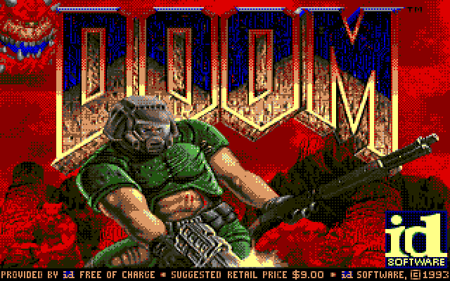

# MD/DOOM



Microfirmware for the [SidecarTridge Multi-device](https://sidecartridge.com) by [Neil Rackett](https://neilrackett.com/atarist)

## Introduction

The SidecarTridge Multi-device is brilliant, but can it run DOOM?

MD/DOOM brings full speed, playable Doom to your Atari ST via your SidecarT. Sound effects use the STE DMA chip if you have one or the YM2149 if you don't. No music at the moment.

You need the shareware `DOOM1.WAD`, which id Software lets anyone distribute.

A big thanks to Graham Sanderson for [rp2040-doom](https://github.com/kilograham/rp2040-doom), which help make this possible, and Jonas Eschenburg because I borrowed the colour palette from [STDOOM](https://github.com/indyjo/STDOOM).

## Installation

1. Download the latest `.uf2`, `.json` and level packs from the [releases page](https://github.com/neilrackett/md-doom/releases).
2. Copy both the `.uf2` and `.json` into the `/apps` folder of your SidecarT's microSD card, and extract all of the E1M\*.whx files into a `/doom` folder.
3. On the Booster screen, press ESC for the app list and select MD/DOOM.
4. To return to Booster, power on your ST while holding the SELECT button on your SidecarT.

See below if you'd prefer to build the level packs yourself.

## Controls

Controls match the original PC Doom:

| Key             | Action                                                                             |
| --------------- | ---------------------------------------------------------------------------------- |
| ↑ ↓ ← →         | Move and turn (the keypad works too)                                               |
| Control         | Fire                                                                               |
| Space           | Use (doors, switches)                                                              |
| Alternate       | Strafe                                                                             |
| Shift           | Run                                                                                |
| 1 to 7          | Weapons                                                                            |
| Esc             | Menu                                                                               |
| Tab             | Automap                                                                            |
| F1 to F10       | Help, save, load, volume, detail, quick-save, end game, messages, quick-load, quit |
| Help            | Gamma (F11 on a PC)                                                                |
| Undo            | Pause                                                                              |
| - and +         | Screen size                                                                        |
| Keypad \* and / | Cycle the dither (nearest, 2×2 and 4×4 Bayer, halftone, blue noise) and the palette (STDOOM, generated, greyscale, EGA, CGA, C64, ZX Spectrum, PICO-8) |

A joystick in port 1 moves, turns and fires. A gamepad through an [Xpad](https://github.com/neilrackett/atarist-xpad) provider does the rest: South fires, East uses, West strafes, North runs, Start opens the menu and Select the map.

Quit from the menu (or pressing F10) returns you to GEM.

### Level packs

Your SidecarT only got 1,152KB available for both code and data, and the smallest we can compress the shareware WAD to is 1,758KB, so MD/DOOM loads level pack at a time (maximim 780KB each), which contains just the map, sprites, textures, flats and sounds needed. We also had to drop the help and credits screens, have monsters that always face you, and sound effects are 5 kHz; `levelpack.py` reports every pack's size against the budget.

If you'd like to build the level packs yourself:

```bash
git clone --depth 1 https://github.com/kilograham/rp2040-doom /tmp/rp2040-doom
cmake -S tools/whd_gen -B build/whd_gen -DRP2040_DOOM_SRC=/tmp/rp2040-doom/src
cmake --build build/whd_gen
python3 tools/levelpack.py DOOM1.WAD packs --doom-src rp/src/doom/doom \
    --whd-gen build/whd_gen/whd_gen --no-ui --no-rotations --sfx-rate 5000
```

## Hardware requirements

- [SidecarTridge Multi-device](https://sidecartridge.com) (RP2040-based ROM cartridge emulator)
- Atari ST, STE, MegaST, or MegaSTE (low res only; high-res falls back to GEM)
- A microSD card for the level packs
- Raspberry Pi Debug Probe or Picoprobe for flashing/debugging (optional, for development)

## How it works

The RP2040 runs Doom on Core 0 at 400 MHz, rendering 320x200 bytes of palette indices. After every frame both cores map those through a 16-colour dither lookup and pack the ST's four bitplanes straight into the cartridge framebuffer, in the m68k's slack between one blit and the next; the m68k blits that to the ST screen every VBL. Sound effects are mixed from a timer interrupt in step with the ST's VBL, so audio keeps up however long a frame takes. Input, the palette and sound ride the cartridge bus in both directions.

```
IKBD keys + joystick       ──$FB82xx──►  demux → Doom events
Xpad gamepad buttons       ──$FB88xx──►  hi byte, then lo at $FB8Axx
Sound chip report (_SND)   ──$FB86xx──►  picks STE DMA or YM2149
Screen: blit + page flip   ◄──$FA8300──  256 → 16 colours + c2p, both cores
Palette: 16 shifter words  ◄──$FA4040──  derived from PLAYPAL each tint
Sound: DMA refill or YM    ◄──$FA4100──  8-channel sfx mix on Core 1
```

## Building

Clone with `--recursive`, or run `git submodule update --init --recursive` before the first build.

```bash
# Production build (pico_w), UUID from uuid.txt
make build

# Debug build (bumps the patch version)
make debug

# Open a UART console on the debug probe
make uart
```

Flash and RAM are both nearly full; `AGENTS.md` has the budgets, the architecture notes and the improvements backlog.

For more on coding for the SidecarT, [the docs are here](https://docs.sidecartridge.com/sidecartridge-multidevice/programming/).

## License

Source code is licensed under the GNU General Public License v3.0. See [LICENSE](LICENSE) for the full text. The vendored engine (`rp/src/doom/`) keeps its own licences: GPLv2 for the Chocolate Doom code and BSD-3-Clause for the RP2040-specific parts, with the files altered for this port marked as such. [Xpad](https://github.com/neilrackett/atarist-xpad), included as the `lib/xpad` submodule, is BSD-2-Clause.

The hero image is a screenshot of [STDOOM](https://github.com/indyjo/STDOOM), standing in until MD/DOOM has one of its own. No game data is included or distributed with this project. Doom is a trademark of id Software.
